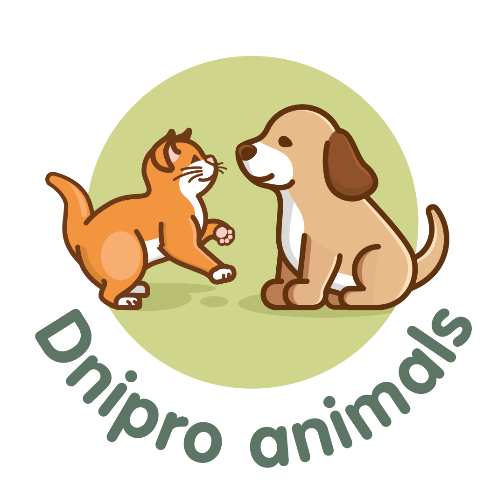

<p align="center">
  
  <h1 align="center">🐾 Dnipro Animals Shelter</h1>
  <p align="center">
    <i>Веб-платформа для автоматизації притулку, створена на хакатоні <b>CUT 2026</b></i>
  </p>
</p>

---

##  Технологічний стек

<table align="center">
  <tr>
    <td align="center"><b>Frontend</b></td>
    <td align="center"><b>Backend</b></td>
    <td align="center"><b>Tools & AI</b></td>
  </tr>
  <tr>
    <td>
       <br>
       <br>
      
    </td>
    <td>
       <br>
       <br>
      
    </td>
    <td>
       <br>
       <br>
      
    </td>
  </tr>
</table>

---

##  Ключові особливості

* Розумний підбір: Інтегрований AI-консультант на базі **Claude Haiku**, що допомагає обрати улюбленця за характером та способом життя.
* Оперативність волонтерів: Керування базою притулку через Telegram-бот: додавання тварини та зміна статусів за лічені секунди.
* Гібридна стійкість: Сайт використовує систему **Auto-Fallback** — якщо сервер недоступний, дані підтягуються зі статичного `pets.json`.
* Безшовної інтеграція: Вебхуки для **Make.com** дозволяють автоматично приймати дані з Google Forms у базу даних сайту.

---

##  Що реалізовано

###  Клієнтська частина
- **Visuals:** Паралакс-ефекти, скляна морфічна верстка (Glassmorphism), плавні анімації.
- **Масштабованість:** Повністю адаптивний дизайн (від смартфонів до 4K моніторів).
- **Interactive:** Модальні вікна з детальними анкетами тварин, вакцинацією та історією.
- **Donation System:** Швидкий доступ до реквізитів (IBAN, Monobank) у два кліки.

### Серверна частина
- **REST API:** Повний цикл CRUD для керування контентом.
- **Database:** SQLite з автоматичною ініціалізацією та синхронізацією зі статичними файлами.
- **Security:** Валідація даних та екологічне середовище в Docker-контейнерах.

---

##  Telegram-бот — команди для волонтерів

| Команда | Функціонал |
| :--- | :--- |
| `/start` | Привітання та список команд |
| `/list` | Швидкий огляд усіх мешканців притулку |
| `/addpet` | Додавання нової анкети з фото |
| `/setstatus` | Моментальна зміна статусу (наприклад: *Прилаштована*) |
| `/adoptions` | Перегляд нових запитів від потенційних власників |

---

##  Структура репозиторію

```bash
DniproAnimal_schelter/
├── backend/               # Серверна логіка (Express, DB, Bot)
├── img/                   # Оптимізована статика (лого, банери)
├── index.html             # Головна сторінка
├── index.css              # Стилі з використанням CSS-змінних
├── index.js               # Клієнтська логіка та AI-інтеграція
├── pets.json              # База-дублер для статичного хостингу
└── docker-compose.yml     # Конфігурація для швидкого розгортання


### pets.json
Файл автоматично синхронізується з БД при кожному записі.
Це дозволяє сайту працювати і як статична GitHub Pages (без бекенду).

### Схема Make.com (Google Forms → сайт)
Альтернативний спосіб для волонтерів без технічних навичок:

Google Форма → Make.com → POST /api/webhook/makepet → БД + pets.json

Поля форми: `name`, `type` (cat/dog), `age`, `gender`, `description`, `photo_url`, `vaccinated`

```

---

## Запуск через Docker 🐋

### 1. Клонуйте репозиторій

```bash
git clone https://github.com/YOUR_USERNAME/DniproAnimal_schelter.git
cd DniproAnimal_schelter
```

### 2. Налаштуйте ключі

```bash
cp backend/.env.example backend/.env
```

Відредагуйте `backend/.env`:

```env
PORT=3000

# Telegram: створіть бота через @BotFather
TELEGRAM_BOT_TOKEN=1234567890:AAxxxxxx...

# ID чату/групи волонтерів (отримайте через @userinfobot)
TELEGRAM_CHAT_ID=-100123456789

# Claude API: console.anthropic.com
ANTHROPIC_API_KEY=sk-ant-...
```

> Без ключів сайт працює повністю. AI-чат повертає контакти замість відповіді, Telegram вимкнений.

### 3. Запустіть

```bash
docker compose up -d
```

Сайт доступний на **http://localhost:3000**

Подивитись логи:

```bash
docker compose logs -f
```

### 4. Зупинити контейнер (дані збережуться)

```bash
docker compose stop
```

Запустити знову:

```bash
docker compose start
```

### 5. Зупинити і видалити контейнер (дані збережуться у volumes)

```bash
docker compose down
```

### 6. Видалити повністю разом із базою даних і фото

```bash
docker compose down -v
```

> Прапор `-v` видаляє Docker volumes — базу SQLite і завантажені фото. Відновити неможливо.

---

## Локальний запуск без Docker

```bash
cd backend
npm install
node server.js
```

Сайт на **http://localhost:3000**

---

## API

| Метод | Endpoint | Опис |
|---|---|---|
| GET | `/api/pets` | Список тварин |
| GET | `/api/pets?type=cat` | Фільтр за видом |
| GET | `/api/pets?status=Шукає родину` | Фільтр за статусом |
| POST | `/api/pets` | Додати тварину (multipart/form-data) |
| PUT | `/api/pets/:id` | Оновити тварину |
| DELETE | `/api/pets/:id` | Видалити тварину |
| POST | `/api/adoptions` | Подати заявку на адопцію |
| GET | `/api/adoptions` | Список заявок |
| POST | `/api/chat` | AI-чат (body: `{ messages: [...] }`) |
| POST | `/api/webhook/makepet` | Вебхук для Make.com |
